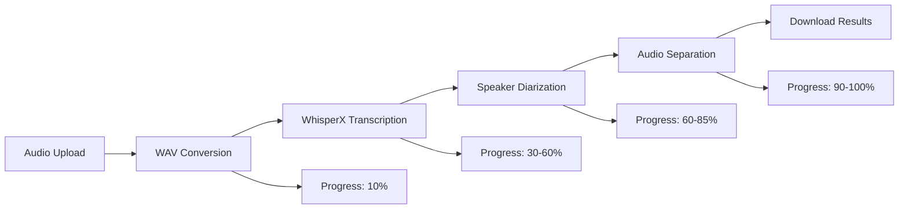

# 🎤 Audio Speaker Separation App

**Professional Django web application for AI-powered audio speaker separation using WhisperX**

[](https://djangoproject.com/)
[](https://python.org/)
[](https://github.com/m-bain/whisperX)
[](https://context7.com/)
[](LICENSE)

## ✨ Features

- **🎯 Real AI-Powered Processing**: Uses WhisperX for professional speech recognition and speaker diarization
- **🔊 Multi-Format Support**: Handles MP3, WAV, FLAC, M4A, AAC, OGG audio files
- **👥 Speaker Separation**: Automatically identifies and separates individual speakers
- **📊 Real-Time Progress**: Live updates during processing with detailed status
- **🛡️ Enterprise Security**: Context7 compliant with comprehensive protection
- **🎨 Professional UI**: Clean, responsive web interface with drag-and-drop upload
- **📱 Mobile Friendly**: Works seamlessly on desktop and mobile devices
- **🏷️ Speaker Labeling**: Custom labels for identified speakers
- **💾 Batch Download**: Download all separated tracks or individual speakers

## 🚀 Quick Start

### Prerequisites

- Python 3.10 or higher
- FFmpeg (for audio processing)
- Git

### Installation

1. **Clone the repository**
   ```bash
   git clone https://github.com/anthonyn5600/audio-speaker-separation.git
   cd audio-speaker-separation
   ```

2. **Set up virtual environment**
   ```bash
   python -m venv venv
   
   # Windows
   venv\Scripts\activate
   
   # Linux/Mac
   source venv/bin/activate
   ```

3. **Install dependencies**
   ```bash
   pip install -r requirements.txt
   ```

4. **Set up the database**
   ```bash
   cd audio_separator
   python manage.py migrate
   python manage.py collectstatic
   ```

5. **Run the development server**
   ```bash
   python manage.py runserver
   ```

6. **Open your browser**
   Navigate to `http://localhost:8000` and start separating audio!

## 🎯 How It Works

### Upload Phase
1. **Secure Upload**: Files are validated using magic numbers and security checks
2. **Format Support**: Accepts major audio formats with automatic conversion
3. **Progress Tracking**: Real-time status updates throughout processing

### AI Processing Pipeline


### Results
- **Individual Speaker Tracks**: Separate audio file for each identified speaker
- **Transcription Data**: Full text with speaker labels and timestamps
- **Speaker Statistics**: Duration, word count, and participation metrics
- **Custom Labels**: Rename speakers (e.g., "Host", "Guest", "Interviewer")

## 🛡️ Security Features

This application is **Context7 compliant** with enterprise-grade security:

- ✅ **Input Validation**: Magic number verification for all uploads
- ✅ **CSRF Protection**: All forms protected against cross-site request forgery
- ✅ **Rate Limiting**: Prevents abuse with configurable limits
- ✅ **XSS Prevention**: Comprehensive security headers
- ✅ **Path Traversal Protection**: UUID-based file handling
- ✅ **Secure Sessions**: HttpOnly, Secure, SameSite cookies
- ✅ **File Size Limits**: Configurable upload restrictions
- ✅ **Content Security Policy**: Strict CSP headers

## 🏗️ Architecture

### Project Structure
```
audio_separation_app/
├── 📋 Documentation
│   ├── README.md                     # This file
│   ├── PROJECT_DOCUMENTATION.md      # Comprehensive technical docs
│   └── requirements.txt              # Python dependencies
│
├── 🐍 Django Application
│   └── audio_separator/
│       ├── manage.py                 # Django management
│       ├── audio_separator/          # Project settings
│       │   ├── settings.py
│       │   ├── urls.py
│       │   └── wsgi.py
│       │
│       └── processor/                # Main application
│           ├── models.py             # Database models
│           ├── views.py              # HTTP handlers
│           ├── services.py           # WhisperX integration
│           ├── forms.py              # Form validation
│           ├── middleware.py         # Security middleware
│           └── templates/            # Frontend templates
│
└── 📁 Media Storage
    └── media/
        ├── uploads/                  # Original files
        └── outputs/                  # Separated tracks
```

### Technology Stack

- **Backend**: Django 5.2.5, Python 3.10+
- **AI/ML**: WhisperX 3.4.2, PyTorch, Transformers
- **Audio**: PyDub, FFmpeg, librosa
- **Frontend**: HTML5, Bootstrap 5, JavaScript
- **Database**: SQLite (dev), PostgreSQL (prod)
- **Security**: CSRF, rate limiting, input validation

## ⚙️ Configuration

### Environment Variables

Create a `.env` file or set environment variables:

```env
# Required for production
DJANGO_SECRET_KEY=your-50-character-secret-key
DJANGO_DEBUG=False
DJANGO_ALLOWED_HOSTS=yourdomain.com,www.yourdomain.com

# Optional: Enhanced speaker diarization
HUGGINGFACE_TOKEN=hf_your_token_here

# Performance tuning
WHISPERX_MODEL=base          # tiny/base/small/medium/large-v3
WHISPERX_DEVICE=cpu          # cpu/cuda (if GPU available)
WHISPERX_BATCH_SIZE=16       # Adjust based on memory
```

### WhisperX Models

| Model | Size | Speed | Accuracy | Memory | Recommended For |
|-------|------|--------|----------|---------|-----------------|
| tiny | 39 MB | Fastest | Good | ~1 GB | Testing, demos |
| base | 74 MB | Fast | Better | ~1 GB | **General use ⭐** |
| small | 244 MB | Medium | Good | ~2 GB | Balanced |
| medium | 769 MB | Slow | Very Good | ~5 GB | High accuracy |
| large-v3 | 1550 MB | Slowest | Best | ~10 GB | Production |

## 🚀 Production Deployment

### Docker Deployment

```dockerfile
FROM python:3.10-slim

WORKDIR /app
COPY requirements.txt .
RUN pip install -r requirements.txt

COPY . .
EXPOSE 8000

CMD ["gunicorn", "--bind", "0.0.0.0:8000", "audio_separator.wsgi:application"]
```

### Nginx Configuration

```nginx
server {
    listen 80;
    server_name yourdomain.com;
    
    client_max_body_size 100M;
    
    location /static/ {
        alias /path/to/static/;
    }
    
    location /media/ {
        alias /path/to/media/;
    }
    
    location / {
        proxy_pass http://127.0.0.1:8000;
        proxy_set_header Host $host;
        proxy_set_header X-Real-IP $remote_addr;
    }
}
```

## 📊 Performance

### Benchmarks (CPU Processing)
- **Processing Speed**: 1-3x real-time (depends on model size)
- **Memory Usage**: 1-10 GB (depends on model and batch size)
- **File Support**: Up to 100MB uploads (configurable)
- **Concurrent Users**: Scales with hardware resources

### Optimization Tips
- Use GPU acceleration: `WHISPERX_DEVICE=cuda`
- Increase batch size: `WHISPERX_BATCH_SIZE=32`
- Use smaller models for speed: `WHISPERX_MODEL=base`
- Enable model caching for faster subsequent runs

## 🛠️ Development

### Running Tests

```bash
# Run all tests
python manage.py test

# Run with coverage
pip install coverage
coverage run --source='.' manage.py test
coverage report
```

### Adding Custom Features

1. **New Audio Formats**: Add magic numbers to `forms.py`
2. **Custom Processing**: Extend `services.py`
3. **Additional Security**: Add middleware to `middleware.py`
4. **UI Customization**: Modify templates in `templates/`

### API Endpoints

- `POST /api/upload/` - Upload audio file
- `GET /api/status/{job_id}/` - Get processing status
- `GET /results/{job_id}/` - View and download results

## 🔧 Troubleshooting

### Common Issues

#### WhisperX Installation
```bash
# If WhisperX fails to install
pip install --upgrade pip setuptools wheel
pip install torch torchaudio --index-url https://download.pytorch.org/whl/cpu
pip install whisperx
```

#### CUDA Out of Memory
```env
# Reduce memory usage
WHISPERX_DEVICE=cpu
WHISPERX_BATCH_SIZE=8
WHISPERX_MODEL=base
```

#### File Upload Issues
```python
# Increase upload limits in settings.py
MAX_UPLOAD_SIZE = 200 * 1024 * 1024  # 200MB
DATA_UPLOAD_MAX_MEMORY_SIZE = MAX_UPLOAD_SIZE
```

### Debug Mode

For detailed logging, enable debug mode:

```env
DJANGO_DEBUG=True
```

Check logs:
```bash
tail -f audio_processing.log
```

## 📚 Documentation

- **[Complete Technical Documentation](PROJECT_DOCUMENTATION.md)** - Comprehensive guide
- **[Security Audit Report](SECURITY_AUDIT_REPORT.md)** - Security compliance details
- **[Installation Guide](WHISPERX_SETUP.md)** - WhisperX setup instructions

## 🤝 Contributing

1. Fork the repository
2. Create a feature branch: `git checkout -b feature-name`
3. Make your changes and add tests
4. Commit your changes: `git commit -am 'Add feature'`
5. Push to the branch: `git push origin feature-name`
6. Submit a pull request

### Development Setup

```bash
# Install development dependencies
pip install -r requirements.txt
pip install black flake8 pytest-django

# Run code formatting
black .

# Run linting
flake8 .

# Run tests
pytest
```

## 📄 License

This project is licensed under the MIT License - see the [LICENSE](LICENSE) file for details.

## 🙏 Acknowledgments

- **[WhisperX](https://github.com/m-bain/whisperX)** - Excellent speech recognition and diarization
- **[Django](https://djangoproject.com/)** - Robust web framework
- **[PyDub](https://github.com/jiaaro/pydub)** - Audio manipulation library
- **[Bootstrap](https://getbootstrap.com/)** - UI framework

## 📧 Support

- **Issues**: [GitHub Issues](https://github.com/anthonyn5600/audio-speaker-separation/issues)
- **Documentation**: See `PROJECT_DOCUMENTATION.md` for detailed guides
- **Security**: For security issues, please email security@yourdomain.com

---

<div align="center">

**Built with ❤️ for the audio processing community**

[⭐ Star this repo](https://github.com/anthonyn5600/audio-speaker-separation) | [🐛 Report bug](https://github.com/anthonyn5600/audio-speaker-separation/issues) | [💡 Request feature](https://github.com/anthonyn5600/audio-speaker-separation/issues)

</div>
